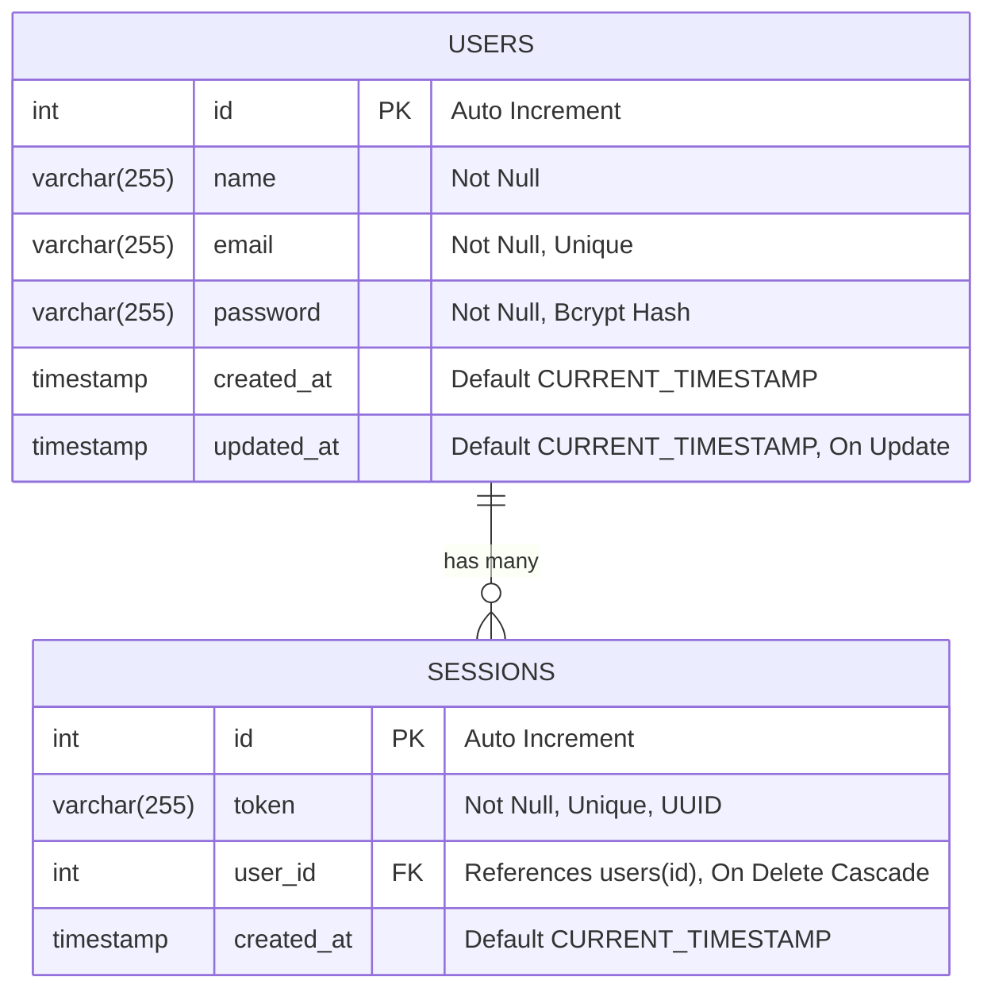

# 🕊️ Project Serenity API

**Project Serenity** adalah backend RESTful API modern, berkecepatan tinggi, dan *type-safe* yang dibangun menggunakan runtime **Bun**, framework **Elysia.js**, dan **Drizzle ORM** dengan database **MySQL**.

Aplikasi ini menyediakan sistem autentikasi pengguna lengkap berbasis token sesi (UUID), hashing password yang aman dengan Bcrypt, dokumentasi interaktif Swagger OpenAPI, validasi input berlapis, dan automated testing terintegrasi.

---

## 🚀 Technology Stack & Libraries

| Komponen | Teknologi / Library | Deskripsi |
|---|---|---|
| **Runtime** | [Bun](https://bun.sh) | Runtime JavaScript/TypeScript modern serba cepat dengan native Bcrypt & UUID support |
| **Framework** | [Elysia.js](https://elysiajs.com) | Framework HTTP performa tinggi untuk Bun dengan type inference end-to-end |
| **ORM** | [Drizzle ORM](https://orm.drizzle.team) | TypeScript ORM ringan, type-safe, dan efisien |
| **Database Driver** | [mysql2](https://github.com/sidorares/node-mysql2) | Driver koneksi MySQL cepat berbasis Promise dan Connection Pooling |
| **Database Migration** | [Drizzle Kit](https://orm.drizzle.team/kit-docs/overview) | CLI toolkit untuk push schema, migrasi, dan Drizzle Studio |
| **API Documentation** | [@elysiajs/swagger](https://elysiajs.com/plugins/swagger.html) | OpenAPI 3.0 & Swagger UI interaktif |
| **CORS** | [@elysiajs/cors](https://elysiajs.com/plugins/cors.html) | Middleware Cross-Origin Resource Sharing |
| **Schema Validation** | TypeBox (`t.Object`, `t.String`) | Validasi skema runtime bawaan Elysia |
| **Security & Cryptography** | `Bun.password` & `crypto` | Password hashing dengan Bcrypt (cost 10) & UUID v4 session token |
| **Automated Testing** | `bun:test` | Built-in test runner Bun yang cepat |

---

## 🏛️ Arsitektur & Struktur File

Aplikasi ini menggunakan pola **Layered Architecture (Separation of Concerns)** untuk memisahkan tanggung jawab antara routing HTTP, business logic, model database, error handling, dan pengujian.

```
project-serenity/
├── .env.example              # Template konfigurasi environment variable
├── .gitignore                # File & folder yang diabaikan git
├── bun.lock                  # Lockfile dependensi Bun
├── drizzle.config.ts         # Konfigurasi Drizzle Kit untuk database MySQL
├── package.json              # Manifest proyek, script, dan dependencies
├── README.md                 # Dokumentasi proyek
├── tsconfig.json             # Konfigurasi TypeScript compiler
├── src/
│   ├── index.ts              # Entry point utama aplikasi & konfigurasi server Elysia
│   ├── config/
│   │   └── env.ts            # Validasi & pembacaan konfigurasi environment variable
│   ├── db/
│   │   ├── index.ts          # Inisialisasi koneksi Drizzle ORM & MySQL connection pool
│   │   └── schema/
│   │       ├── users.ts      # Schema Drizzle untuk tabel 'users'
│   │       └── sessions.ts   # Schema Drizzle untuk tabel 'sessions'
│   ├── errors/
│   │   └── index.ts          # Custom Error classes (UnauthorizedError, BadRequestError)
│   ├── routes/
│   │   ├── index.ts          # Aggregator & registrasi seluruh router aplikasi
│   │   ├── health.ts         # Router untuk endpoint health check
│   │   └── users-route.ts    # Router untuk endpoint autentikasi & manajemen users
│   └── services/
│       └── users-service.ts  # Business logic layer (registrasi, login, session, user profile)
└── tests/
    ├── helpers/
    │   └── db-helper.ts      # Helper pembersih database sebelum pengujian (test isolation)
    ├── health.test.ts        # Automated tests untuk root & health check
    ├── users-register.test.ts# Automated tests untuk registrasi user
    ├── users-login.test.ts   # Automated tests untuk login user
    ├── users-current.test.ts # Automated tests untuk get current user
    └── users-logout.test.ts  # Automated tests untuk logout user
```

### 📐 Konvensi Penamaan File:
- **Routes Layer**: Menggunakan akhiran `*-route.ts` atau `*.ts` di dalam `src/routes/` (contoh: `users-route.ts`, `health.ts`).
- **Services Layer**: Menggunakan akhiran `*-service.ts` di dalam `src/services/` (contoh: `users-service.ts`).
- **Database Schema**: Menggunakan nama tabel tunggal/jamak di dalam `src/db/schema/` (contoh: `users.ts`, `sessions.ts`).
- **Testing Files**: Menggunakan akhiran `*.test.ts` di dalam folder `tests/` (contoh: `users-login.test.ts`).

---

## 🗄️ Database Schema & Relasi

Aplikasi menggunakan 2 tabel utama pada MySQL:



### 1. Tabel `users`
| Kolom | Tipe Data | Constraint | Deskripsi |
|---|---|---|---|
| `id` | `INT` | Primary Key, Auto Increment | ID unik pengguna |
| `name` | `VARCHAR(255)` | Not Null | Nama lengkap pengguna (maks 255 karakter) |
| `email` | `VARCHAR(255)` | Not Null, Unique | Alamat email unik pengguna |
| `password` | `VARCHAR(255)` | Not Null | Password yang di-hash dengan algoritma Bcrypt |
| `created_at` | `TIMESTAMP` | Not Null, Default `CURRENT_TIMESTAMP` | Waktu akun dibuat |
| `updated_at` | `TIMESTAMP` | Not Null, On Update `CURRENT_TIMESTAMP` | Waktu akun terakhir diperbarui |

### 2. Tabel `sessions`
| Kolom | Tipe Data | Constraint | Deskripsi |
|---|---|---|---|
| `id` | `INT` | Primary Key, Auto Increment | ID unik sesi |
| `token` | `VARCHAR(255)` | Not Null, Unique | Token sesi unik (UUID v4) |
| `user_id` | `INT` | Not Null, FK -> `users.id` (Cascade) | Relasi ke ID user pemilik sesi |
| `created_at` | `TIMESTAMP` | Not Null, Default `CURRENT_TIMESTAMP` | Waktu sesi dibuat |

---

## 🔌 Dokumentasi Endpoint API

Base URL: `http://localhost:3000`

Interactive Swagger Docs: [http://localhost:3000/swagger](http://localhost:3000/swagger)

---

### 1. Root & Health Check

#### • `GET /` — Root Info
Mengembalikan informasi status dasar aplikasi.
- **Response `200 OK`**:
  ```json
  {
    "name": "Project Serenity API",
    "version": "1.0.0",
    "status": "running"
  }
  ```

#### • `GET /health` — Health Check
Memeriksa status koneksi ke database MySQL.
- **Response `200 OK`**:
  ```json
  {
    "status": "ok",
    "database": "connected"
  }
  ```

---

### 2. Autentikasi & Users

#### • `POST /api/users` — Registrasi User Baru
Mendaftarkan akun pengguna baru ke dalam sistem. Password akan otomatis dienkripsi dengan Bcrypt.
- **Headers**: `Content-Type: application/json`
- **Request Body**:
  ```json
  {
    "name": "Serenity User",
    "email": "serenity@example.com",
    "password": "password123"
  }
  ```
- **Response Sukses `200 OK`**:
  ```json
  {
    "data": "OK"
  }
  ```
- **Response Error `400 Bad Request`**:
  ```json
  {
    "error": "Email sudah terdaftar"
  }
  ```
  *(Atau pesan validasi seperti nama kosong/terlalu panjang, format email tidak valid, password < 6 karakter)*

---

#### • `POST /api/users/login` — Login User
Mengautentikasi pengguna dengan email dan password, serta membuat token sesi UUID baru.
- **Headers**: `Content-Type: application/json`
- **Request Body**:
  ```json
  {
    "email": "serenity@example.com",
    "password": "password123"
  }
  ```
- **Response Sukses `200 OK`**:
  ```json
  {
    "data": "542de5f1-aabc-42d0-a9b4-fac8ffc923f4"
  }
  ```
- **Response Error `400 Bad Request`**:
  ```json
  {
    "error": "Email atau password salah"
  }
  ```

---

#### • `GET /api/users/current` — Get Current User Profile
Mengambil data profil pengguna yang sedang login berdasarkan Bearer token sesi yang aktif.
- **Headers**: `Authorization: Bearer <token_uuid>`
- **Response Sukses `200 OK`**:
  ```json
  {
    "data": {
      "id": 1,
      "name": "Serenity User",
      "email": "serenity@example.com",
      "created_at": "2026-08-23T13:26:40.000Z"
    }
  }
  ```
  *(Kolom `password` dijamin tidak disertakan demi keamanan)*
- **Response Error `401 Unauthorized`**:
  ```json
  {
    "error": "Unauthorized"
  }
  ```

---

#### • `DELETE /api/users/logout` — Logout User
Menghapus session token dari tabel `sessions` di database agar sesi tidak dapat digunakan lagi.
- **Headers**: `Authorization: Bearer <token_uuid>`
- **Response Sukses `200 OK`**:
  ```json
  {
    "data": "OK"
  }
  ```
- **Response Error `401 Unauthorized`**:
  ```json
  {
    "error": "Unauthorized"
  }
  ```

---

## ⚙️ Panduan Setup & Instalasi

### 1. Prasyarat Sistem
Pastikan perangkat Anda telah terpasang:
- [Bun](https://bun.sh/) (versi 1.1 ke atas)
- [MySQL Server](https://dev.mysql.com/downloads/) (versi 8.0 ke atas)

### 2. Clone Repository
```bash
git clone https://github.com/diyarayaaa/project-serenity.git
cd project-serenity
```

### 3. Install Dependencies
```bash
bun install
```

### 4. Konfigurasi Environment Variables
Salin template file `.env.example` menjadi `.env`:
```bash
cp .env.example .env
```
Sesuaikan konfigurasi kredensial database MySQL Anda di dalam file `.env`:
```env
PORT=3000
DATABASE_HOST=localhost
DATABASE_PORT=3306
DATABASE_USER=root
DATABASE_PASSWORD=your_mysql_password
DATABASE_NAME=project_serenity
```

> **Catatan:** Pastikan database dengan nama `project_serenity` sudah dibuat di server MySQL Anda (`CREATE DATABASE project_serenity;`).

### 5. Sinkronisasi Skema Database
Gunakan Drizzle Kit untuk membuat tabel-tabel ke dalam database:
```bash
bun run db:push
```

---

## 🏃 Cara Menjalankan Aplikasi

### Mode Development (Hot Reload)
Jalankan server pengembangan dengan fitur auto-reload saat kode diubah:
```bash
bun run dev
```
Aplikasi akan berjalan pada: **`http://localhost:3000`**

### Mode Production
Jalankan server dalam mode standar:
```bash
bun run start
```

### Membuka Drizzle Studio (Database GUI)
Drizzle Studio menyediakan antarmuka visual berbasis web untuk melihat dan memanipulasi data database secara langsung:
```bash
bun run db:studio
```
Akses Drizzle Studio pada: **`https://local.drizzle.studio`**

---

## 🧪 Cara Menjalankan Automated Tests

Aplikasi dilengkapi dengan rangkaian automated unit & integration test komprehensif menggunakan `bun:test`. Setiap pengujian dijalankan dengan isolasi database yang bersih.

### Menjalankan Seluruh Test Suite
```bash
bun test
```

### Menjalankan Test File Tertentu
```bash
# Test endpoint registrasi
bun test tests/users-register.test.ts

# Test endpoint login
bun test tests/users-login.test.ts

# Test endpoint current user
bun test tests/users-current.test.ts

# Test endpoint logout
bun test tests/users-logout.test.ts

# Test health check
bun test tests/health.test.ts
```

### Type Checking
Untuk memastikan tidak ada kesalahan tipe data TypeScript di seluruh proyek:
```bash
bunx tsc --noEmit
```

---

## 📜 Daftar NPM / Bun Scripts

| Script | Perintah | Deskripsi |
|---|---|---|
| `bun run dev` | `bun --watch src/index.ts` | Menjalankan server dev dengan watch/hot reload |
| `bun run start` | `bun src/index.ts` | Menjalankan server produksi |
| `bun run test` | `bun test` | Menjalankan seluruh automated unit & integration tests |
| `bun run db:generate` | `bunx drizzle-kit generate` | Menghasilkan file migrasi SQL dari schema Drizzle |
| `bun run db:push` | `bunx drizzle-kit push` | Menerapkan perubahan schema TypeScript langsung ke database MySQL |
| `bun run db:studio` | `bunx drizzle-kit studio` | Membuka Drizzle Studio web interface |

---

## 📄 Lisensi
Proyek ini dibuat untuk keperluan internal dan pengembangan backend **Project Serenity**.
